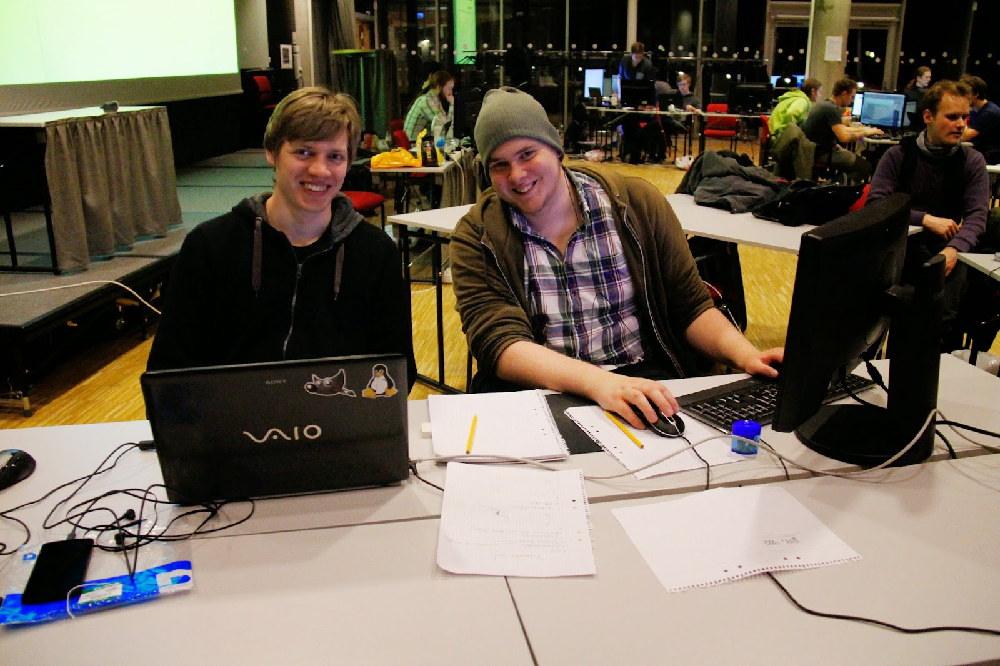

Join me today as I reflect on another game jam and the new game I built.

## Theme Announcement

> BOSSJam is an event where participants are given 48 hours to sit and create a game entirely from scratch!
>
> The restriction is that the game should be based on a specific theme, which is announced shortly before the event begins. BOSSJam is an excellent opportunity for you to develop your skills in game development, which can help you in the future!
>
> \- Blekinge Organiserade Spelstudenter

The theme for the jam was "Inkorrekt val" (which translates to incorrect whale/choice). This meant several games featured whales as a fun element.

## Project: Downhill Willy 

**Team:** Rasmus Nordling (me) and Michael Cassel (uni friend). We programmed the game mechanics together and he made all the vector graphics and found the [yodel loop](https://youtu.be/oZwo-ui37rQ?si=NYCd36u4oIezswYX&t=28). 

**Idea:** You play as Willy the whale and the target is to race down the hill for as long as you can. Watch out for those logs, stones, trees and snowmen blocking the lanes.

**Implementation and Features:** Downhill Willy is written in Lua and uses the [LÖVE](https://www.love2d.org/) (Love2D) framework. I can't recommend it enough for quickly getting a playable prototype. All code and assets used are open-source on [GitHub](https://github.com/HappyStinson/downhill-willy).

- Like many 2D games we use the popular technique "parallax effect" to create an illusion of depth, immersion, enhance the visual aesthetics, and create a sense of dynamic movement in the game environment.
- Cool graphics with a subtle scarf animation and vectorized assets
- The obstacles are randomly spawned by our algorithm, so no two runs are the same

**Gameplay:** You move Willy up or down to keep on skiing and avoid a nasty accident. How far can you make it? This video shows what the game is like to play.

https://www.youtube.com/watch?v=TyWreu4zX1c

**Downloads:**

You can download the game and play it on Windows, macOS, and Linux.

**ITCH EMBED** eller det er okej? title for accesibility kanske.

<iframe frameborder="0" src="https://itch.io/embed/52605" width="552" height="167"></iframe>

## Other Entries

These are a few other cool games made during the same event.

https://www.youtube.com/watch?v=jPTSsrDcEZs

https://www.youtube.com/watch?v=e_FFYaBpCJE

## Conclusion

I hope that sharing my weekend developing Downhill Willy brought you some joy.

Until you here from me again.

/ Rasmus
