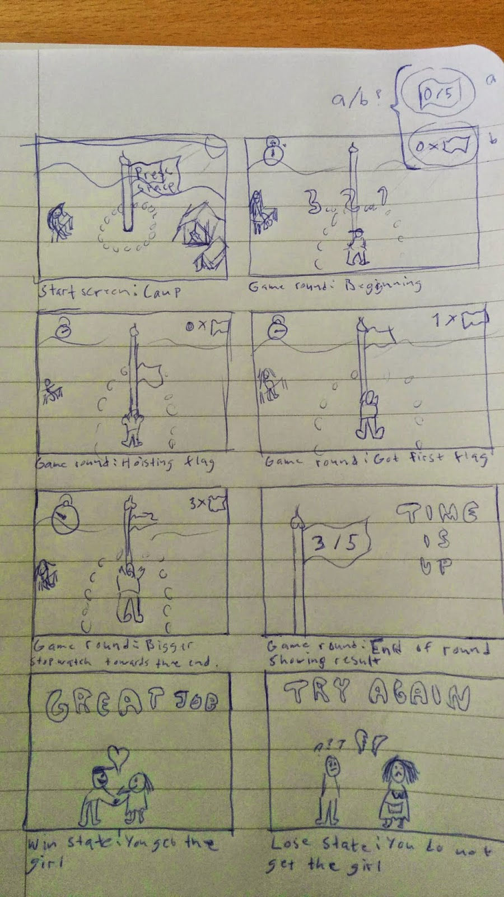

In this post I'm announcing my small Unity game *Flag Frenzy* that I develop as part of One Game A Month.

## Blog Comeback

Here comes another modest *hej* since I'm fired up again. Hej (or hej hej) is the most common way to greet someone in Swedish. Now that you've learned that, let's move on.

First of all, I just want to say that it's fun to write again. I appreciate every little like and appreciation that I'm getting.  It feeds my endorphin supply and feels like a virtual pat on the back. Although I don't want to get addicted and risk becoming a male version of [Kissie](https://en.wikipedia.org/wiki/Kissie). That is not how I imagined my future life to look like. 

However, I have some plans in progress that I'm revealing now!

## Game Development Update

I unfortunately got rejected by [Futuregames](https://futuregames.se/) and won't be starting their Game Design course.

Instead I have to find ways to keep making games on my own for now.

### Theme and Inspiration

This led me to an article about creating 12 games in a year. With a boost in both inspiration and motivation I signed up for [One Game a Month](https://onegameamonth.com/) to start working on Game 1/12.

The intention is to make one game a month, and grow as a developer with every release.

This month's optional theme is "Flags", and I've already thought up a plan on how to approach it.

### Project: Flag Frenzy

With only a few weeks left before the deadline, my intention is to make a tiny game in Unity that I will be able to finish on time.
I imagine a simple button masher with the aim of hoisting as many flags as possible, for one minute, to impress a girl. *One of my readers suggested the love girl should be called Flag-Ann and I like it!*

With enough skill, Ann will fall in love and you can feel satisfied. Otherwise she gets angry and it's bye-bye. Cute idea to hoist flags [in the name of love](https://www.youtube.com/watch?v=LHcP4MWABGY).

Whether the game is about me or based on a real event has not been made official. 

Here is an early sketch of the game mechanics.

Thanks for this time!

/ Rasmus
