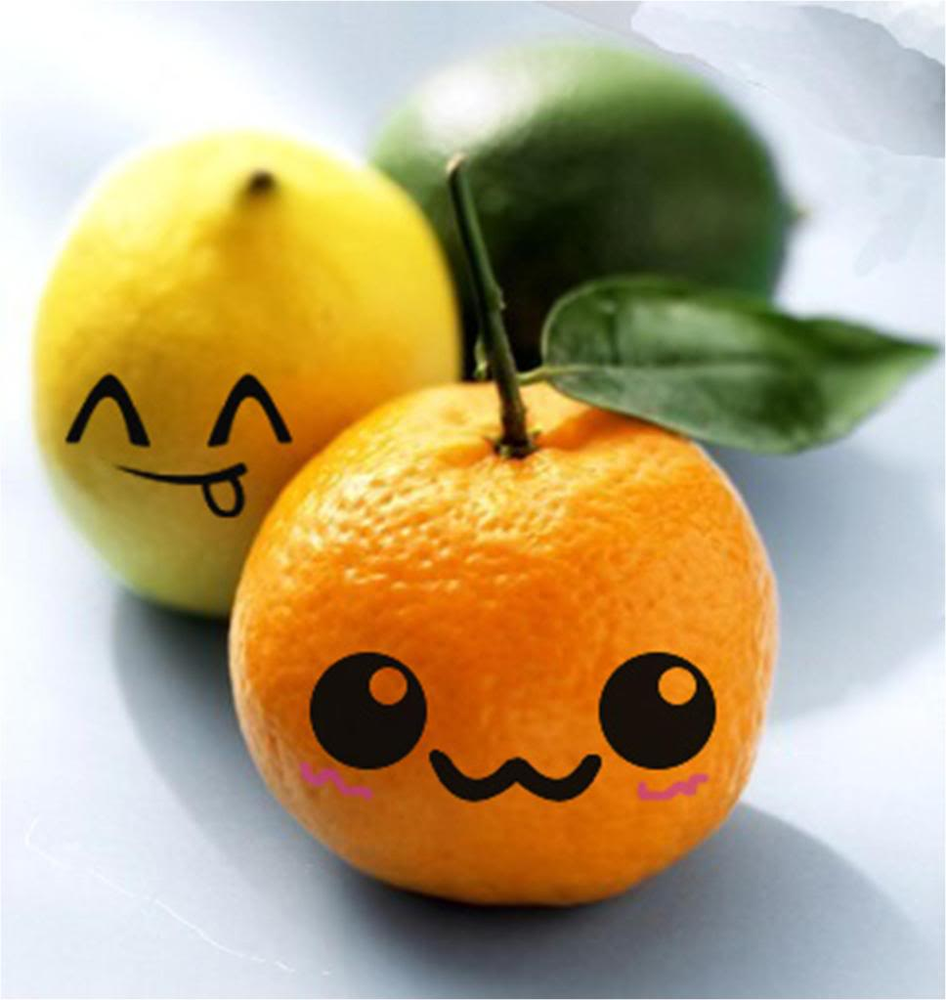

I talk about some blog updates, the Vim text editor, and cross-compiling with CMake.

Now I've been lying under the stone for far too long, and it's time to write a bit here.

Started on a nice navigation menu to make it easier to categorize the posts, just as it was intended for me to do when I started it all from the beginning, so to speak, to keep it concise and clear... But most importantly, the blog has a new name and also a new address happykodar.blogspot.com, yay! 

**COME BACK TO THIS...**

All the *labels* are in the list to the right if you feel adventurous.[^1]
I've spent way too much (a little) time on the text editor [Vim](https://www.freecodecamp.org/news/vim-beginners-guide/) and haven't read anything for several days. Time to do that now (after i publish this ofcourse).

[^1]: The design for Nordling.xyz uses Tags to group related posts. You'll find them under the title.

## Advanced Programming

I've looked into cross-compiling with CMake and written a first toolchain file, which basically means compiling code for a platform other than the one performing the compilation.  That means it'll be damn easy (I hope) to build, for example, an exe-file (executable Windows program) on my Linux machine! It's fantastic what one can come up with. 

Well, now I'm off to read!

Goodbye!

## 2025 Update

As far as I'm concerned happy kodar *is* the OG blog. I can't remember what I was talking about here that I used initially.

/ Rasmus
