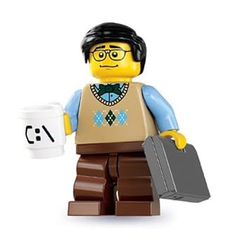

I share my plan going forward with my Unity game *Flag Frenzy*.

Clap the beat for my Monday song. *Blog party*, *blog party* all day long!

## The Plan

I have set a deadline of Monday in seven days to be able to take it easy and iron out bugs (features), and polish the last few days before submission.

Here's my plan for the upcoming week:

- Mon 21/7 - Expand the game mechanics
- Tue 22/7 - Game mechanics
- Wed 23/7 - Game Over logic
- Thu 24/7 - Clean the facade (Graphics, Textures, Sprites)
- Fri 25/7 - King at the bar, on Pay Day
- Sat 26/7 - Långö Beach

Now and a few hours ahead, I intend to sit with the game mechanics, which is quite boring at the moment. The goal is to change the flag so that it is affected by gravity and hoisted with a force. Then birds fly in which it is important to avoid, otherwise you have to hoist the flag again. This hopefully contributes to a more dynamic game than just tapping your space bar as fast as you can, which is basically the game in the current situation. 

### Wednesday

Then on Wednesday it will be to fix different "endings". That is, either you win and there is a happy ending or you lose and there is a broken heart, because [Love Hurts](https://www.youtube.com/watch?v=rhnZ19sbxps). 

### Thursday

Thursday is dedicated to "polishing the turd".  Play Picasso in GIMP* and look for textures and nice pictures to have as graphics. But you must not forget the sounds! Could be nice with a small music loop and a "ping" for each flag you hoist. Animations are a big *MAYBE*. I imagine that to be a daunting task.

	
GIMP, or GNU Image Manipulation Program, is a free and open-source raster graphics editor and a popular alternative to Photoshop for photo editing and graphic design.

### Friday

Then on Friday comes pay and I deserve a big beer.  Before I go out, however, I have plans to fix a home screen / main menu with instructions and background history about our flag guy and **Flagg-Ann**.

Alright. Thanks for your attention. I's time for me to work.

/ Rasmus
