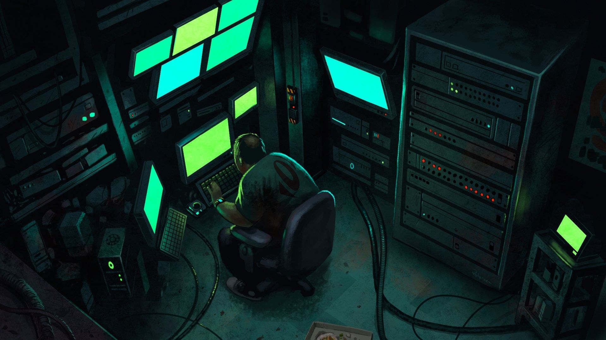

I share my longing for a Mac and an ergonomic workspace.

Hello everyone! Including myself.

Well, what can I say? It would be really nice to have a Mac standing next to me, purring like only a puma can. A feline that doesn't give me itchy eyes and a runny nose.

I imagine myself sitting in a room with outrageously ergonomic [Kinnarps chairs](https://www.kinnarps.com/knowledge/find-the-perfect-office-chair-and-increase-workplace-well-being/), those adjustable desks, a vending machine, and of course, my different machines, each running Windows, Linux, and Mac. A skilled but above all crazy and serious developer (read Happy) should probably have several machines, right? It's only fair. Ah, what a wonderful thought.

But now I shouldn't lie under the covers and daydream; I should, of course, start coding. I was thinking of rewriting all the old C++ assignments and making them cross-platform. I'm not saying it's a *good* start, but it's at least a *start*, and everything that has a start also has an *end*! 

But enough about that!

/ Rasmus
