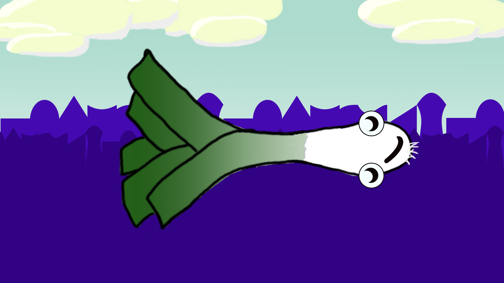

I recently attended the 10th anniversary of the [Nordic Game Jam](https://www.nordicgamejam.com/) in Copenhagen, and it was an exhilarating experience.

### Pre-Jam Activities

Before the jam began, there was a pre-party where we enjoyed beers and played games together (go check out [Stikbold!](https://www.stikbold.com/)). I particularly enjoyed the talks from Blizzard, [Ojiro Fumoto](https://twitter.com/OjiroFumoto), and [Adriel Wallick](https://msminotaur.com/), which inspired me to pursue the Game a Week challenge. [Butt](https://butt.holdings/fionna-butts.gif), I've decided to put it on hold for now.

## Theme and Inspiration

The theme for the jam was "Leak", leading many participants to incorporate leeks into their games.

## Project: Champions Leek

### Team and Idea

**Team:** Me and three Danish guys, with a mix of programmers and a producer/artist.

**Idea:** After brainstorming several ideas, we settled on "Rocket Leeks" (later renamed Champions Leek). It's a local multiplayer racing game for Google Chromecast, where players control leeks with their smartphones. The goal? To be the last leek standing in this crazy party game.

### Successes and Challenges

#### Successes

- We found a great team and nearly completed a game.
- Unity worked well on Linux.

#### Challenges

- We encountered difficulties with [Unity Remote](https://docs.unity3d.com/Manual/UnityRemote5.html) on Linux and struggled to implement accelerometer input without being able to test with a phone.
- Time constraints prevented us from implementing multiplayer due to issues with the Unity [Photon plugin](https://assetstore.unity.com/packages/tools/network/photon-unity-networking-classic-free-1786).
- Managing Unity projects with Git proved challenging, resulting in repository issues.

### Lessons Learned

I discovered the coolness of Denmark and learned the importance of caution when version controlling Unity projects.

<figure>

  
  <figcaption>Mr. Leek is happy to be flying in the game</figcaption>
</figure>

Now, I'm eager to play some of the [jam games](https://itch.io/jam/ngj16/entries) and continue coding.

/ Rasmus
