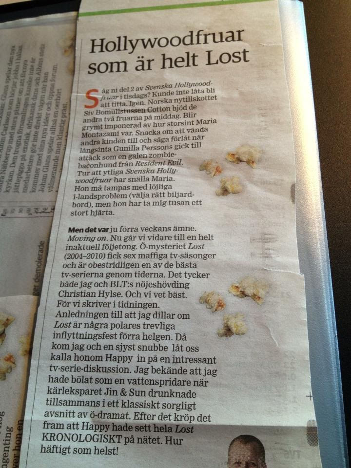
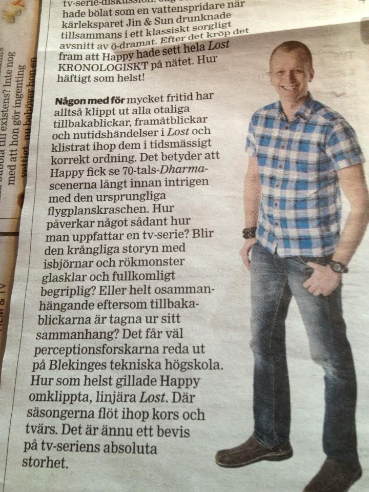

I share my Programming Portfolio and talk about watching LOST in a linear fashion.

Now then!

Here I am again. Blogging and listening to Smashing Pumpkins.

https://www.youtube.com/watch?v=8-r-V0uK4u0

I've spent a few hours going through my "Portfolio" folder that was gathering dust in a very important place, my aptly named partition: *In Utero* (named after Nirvana's third studio [album](https://open.spotify.com/album/68uIz7DtgDoPUFTKxdzL9t?si=ACK63YhASciWUkxwoY2tKA)).
Now there's some stuff up on my Dropbox that hopefully runs pretty smoothly. I've checked to see if it works, but it might require an installation of some Microsoft runtime, which can be considered cumbersome.
Anyway, I'm going to watch a bit of [LOST](http://www.chronologicallylost.com/) now.

Take a look at my stuff, you know. Feel the code flowing through your veins. 

`std::cout << "bye";`

## 2024 Comments

After coming back to this post after 10 years and 9 months later, on 26th February, I discovered that several important links were broken. This meant whatever folder I wanted to show had gone AWOL.

Nowadays to make life simpler (who doesn't want simpler) I add any new project to my already diverse and eclectic programming [portfolio](https://github.com/HappyStinson) over at GitHub.

What can you do with GitHub?

- See my source code
- Download, install, and run my programs
- Make your own derivatives (fork) of my work

### Watching Chronologically LOST

Another thing worth mentioning is that in 2016 I met another huge LOST fan. Our conversation made it to the local newspaper, which you can find further down (in Swedish). Here's the English translation:

> The island mystery *Lost* (2004-2010) had six massive television seasons and is undeniably one of the best TV series of all time. Both I and [BLT](https://www.blt.se/)'s head of entertainment Christian Hylse think so. And we know best. Because we write in the newspaper. The reason I'm raving about *Lost* is some pals' nice housewarming party last weekend. Then me and a nice guy let's call him Happy got into an interesting TV series discussion. I confessed that I had seethed like a sprinkler when love couple Jin & Sun drowned together in a classic sad episode of the island drama. After that, it came out that Happy had watched all of *Lost* CHRONOLOGICALLY online. As cool as it gets!
>
> **So someone with too** much free time has cut out all the countless flashbacks, forwards and present events in *Lost* and pasted them together in chronologically correct order. This means that Happy got to see the 70s Dharma scenes long before the plot of the original plane crash. How does something like that affect how one perceives a TV series? Does the complicated storyline with polar bears and smoke monsters become crystal clear and completely comprehensible? Or completely incoherent because the flashbacks are taken out of context? Perhaps the perception researchers at Blekinge University of Technology will find out. Anyway, Happy liked recut, linear *Lost*. Where the seasons flowed together crosswise. It is yet another proof of the absolute greatness of the television series.
>
> \- Johan

I have yet to find another TV-show that made such an impact on me that LOST did. Perhaps it's time for a second rewatch?

bye

/ Rasmus
